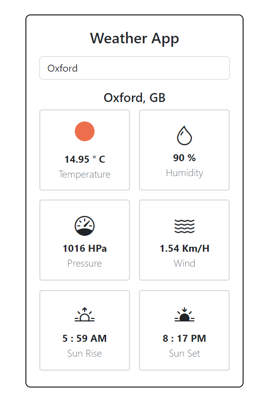

# React Weather App
Creation of weather app where we can find wheather condition of  any city around the world.


### Demo - Deployed over Vercel
react-weather-app-sable.vercel.app

## Built With
1. React Hooks (useState, useEffect, useRef).
2. BootStrap.
3. JSX.
4. Functional Components. 
5. Conditional Rendering.
6. Forms.

## Screenshot


## Getting Started

### APIs Used
[Open Weather APIs](https://openweathermap.org/)

https://openweathermap.org/current

### API Info
* Method: `GET`
* URL: `https://api.openweathermap.org/data/2.5/weather?q={CITY_NAME}&appid={API_KEY}`

### Libraries used
* `axios`
* `react-scripts`

### Getting Started

To get a local copy follow these steps:

1. Clone the repo by typing on your terminal

```
git clone (https://github.com/RaviTejaM9602/react-weather-app)
```

2. Access the repo with

```
cd Conference
```

3. Clone the Repo or Download the Zip file
Run the live server or simply open index.html with your browser.

```
code .
```

### How can I appreciate this repo? 
## Authors

👤 **Ravi Teja M**
- GitHub: [@githubhandle](https://github.com/RaviTejaM9602/Awesome_Books)
- Twitter: [@twitterhandle](https://twitter.com/RaviTejaMekala1)
- LinkedIn: [LinkedIn](https://www.linkedin.com/in/ravi-teja-8499a31b9/)

## 🤝 Contributing

Contributions, issues, and feature requests are welcome!

Feel free to check the [issues page](../../issues/).

## Show your support

Give a ⭐️ if you like this project!

## 📝 License

This project is [MIT](./MIT.md) licensed.
Ravi Teja
